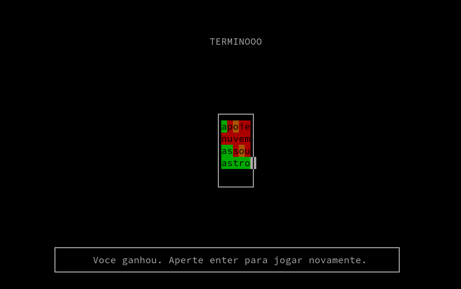

# Terminooo

Terminooo é um jogo que você deve adivinhar uma palavra de 5 letras da
língua portuguesa. 



# Compilação e execução

```
$ make
$ ./terminooo
```

# Licença

Esse programa é distribuído sob a licença GNU GPL v3.
